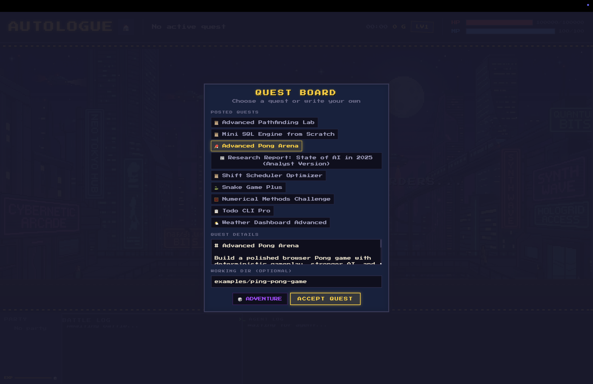
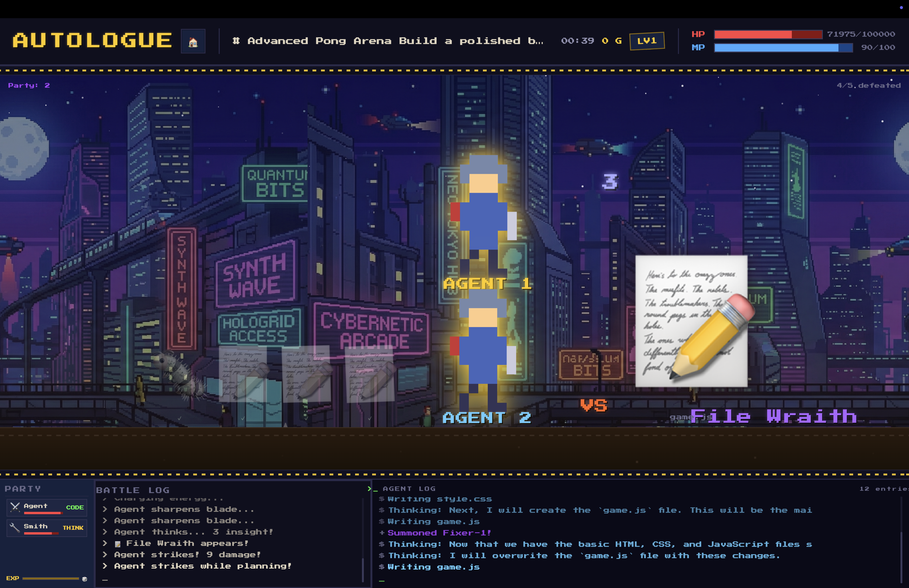

# Autologue

Autologue is a coding-agent game UI.  
Agent actions are turned into RPG-style battle events in real time.

## What It Does

- Runs an agent backend (`openrouter` or `gemini-cli`) for each quest.
- Maps backend events to game events (`FILE_READ`, `TEST_PASS`, `QUESTION`, etc.).
- Reduces events into a single canonical `GameState`.
- Streams state to the web client over WebSocket.
- Shows a battle scene with party, enemy encounters, battle log, and results.

## Screenshots

### Menu



### Play Screen



## Current Runtime Architecture

```text
Agent Backend (OpenRouter or Gemini CLI)
  -> EventMapper (pattern/action classification)
  -> Game Reducer (pure state transitions)
  -> WebSocket session stream
  -> React Web UI (battle/game overlays)
```

Notes:
- Server default backend is `openrouter` (`AGENT_BACKEND` not set).
- Terminal UI directly uses `GeminiProcess` from core (separate from server backend switching).

## Quick Start

### Prerequisites

- Node.js 18+
- pnpm
- API credentials (OpenRouter recommended for current default flow)

### Install

```bash
pnpm install
```

### Configure `.env`

```bash
# Backend selector: openrouter (default) or gemini-cli
AGENT_BACKEND=openrouter

# OpenRouter backend
OPENROUTER_API_KEY=...
OPENROUTER_MODEL=google/gemini-2.5-flash-lite

# Gemini CLI backend (optional)
# AGENT_BACKEND=gemini-cli
# GEMINI_MODEL=gemini-2.5-flash
# GEMINI_CLI_PATH=gemini
```

If `OPENROUTER_MODEL` is omitted, server code falls back to `google/gemini-2.0-flash-001`.

### Run Web + Server

```bash
pnpm dev
```

- Server: `http://localhost:3001`
- Web UI: `http://localhost:5173`

### Run Terminal UI

```bash
pnpm dev:terminal
```

## Game Mechanics (As Implemented)

### Resources

- Context (`HP`): `contextMax` defaults to `100,000`.
- MP: defaults to `100`.
- EXP/Level: level-up based on accumulated EXP.

### Game Over Conditions

- `contextUsed >= contextMax`
- Main agent HP reaches `0`
- Fatal error event

### Damage Model

- Event-driven context load increases `contextUsed`.
- HP damage is derived from context deltas (`~3000 tokens per HP`) plus overload penalties.
- Long initial prompts cause immediate opening damage:
  - first `180` estimated tokens are free
  - then `~180 tokens` per extra HP damage

### Revive

- Available in `game-over` phase.
- Adds `+100,000` context capacity.
- Restores `+50 HP` to main agent.
- Restarts agent execution with continuation prompt.

### Tactics

All tactics cost `15 MP`.

- `summarize` -> context recovery `100,000`
- `split-task` -> context recovery `50,000`
- `forget` -> context recovery `150,000`
- `checkpoint` -> no context recovery
- `delegate` exists in core, but web keyboard/menu currently exposes the first 4 tactics

### Sub-agent Spawn Rules

In current mapper logic, sub-agents can appear by:

- first file-read action -> scout-type spawn
- third file-write action -> fixer-type spawn
- first test-run action -> tester-type spawn
- model message patterns (`spawning agent`, `delegating to`, etc.)

## Controls (Web)

- Question phase: `A / B / C` to answer.
- Running/question phase: `1 / 2 / 3 / 4` for tactics.
- Header has a home button (`🏠`) to return to quest board and reset session UI state.

## UI Flow

1. `GuildBoard` overlay in idle state (example selection + custom prompt).
2. `BattleArena` during run:
   - random stage background from 3 PNG assets
   - looping horizontal parallax
   - split frontline when multiple agents exist
3. `VictoryScreen` on completion:
   - score/rank summary
   - file list + code viewer
   - iframe preview for generated HTML outputs
4. `GameOverScreen`:
   - revive button
   - return-to-board button

## Examples

Quest prompts are loaded dynamically from `examples/*/README.md` via `/api/examples`.

Current built-in quests include:

- `ping-pong-game`
- `snake-game`
- `todo-cli`
- `weather-dashboard`
- `research-report`
- `solve-equations`
- `mini-sql-engine`
- `shift-scheduler-optimizer`
- `advanced-pathfinding-lab`

See `examples/README.md` for a challenge index.

## API and Protocol

### HTTP

- `GET /api/health`
- `GET /api/examples`
- `GET /api/session/:id/state`
- `GET /api/session/:id/events`

### WebSocket (`/ws`)

Client -> server:

- `start-quest`
- `player-choice`
- `tactic`
- `revive`
- `delete-output`

Server -> client:

- `session-id`
- `game-event`
- `state-update`
- `error`
- `output-deleted`

## Project Structure

```text
.
├── apps/
│   ├── server/      # Express + WS session orchestration + backend process adapters
│   ├── web/         # React battle UI (status, arena, overlays)
│   └── terminal/    # Ink-based terminal renderer
├── packages/
│   └── core/        # Shared protocol, reducer, mapper, adapter utilities
└── examples/        # Quest prompt packs (Markdown)
```

## Scripts

- `pnpm dev` -> server + web
- `pnpm dev:server`
- `pnpm dev:web`
- `pnpm dev:terminal`
- `pnpm build`
- `pnpm typecheck`

## Notes

- OpenRouter tool execution is intentionally sandboxed to the session output directory.
- `run_command` in `OpenRouterProcess` returns simulated outputs for common commands.
- There is no dedicated automated test suite yet; use `pnpm typecheck` as a baseline check.
